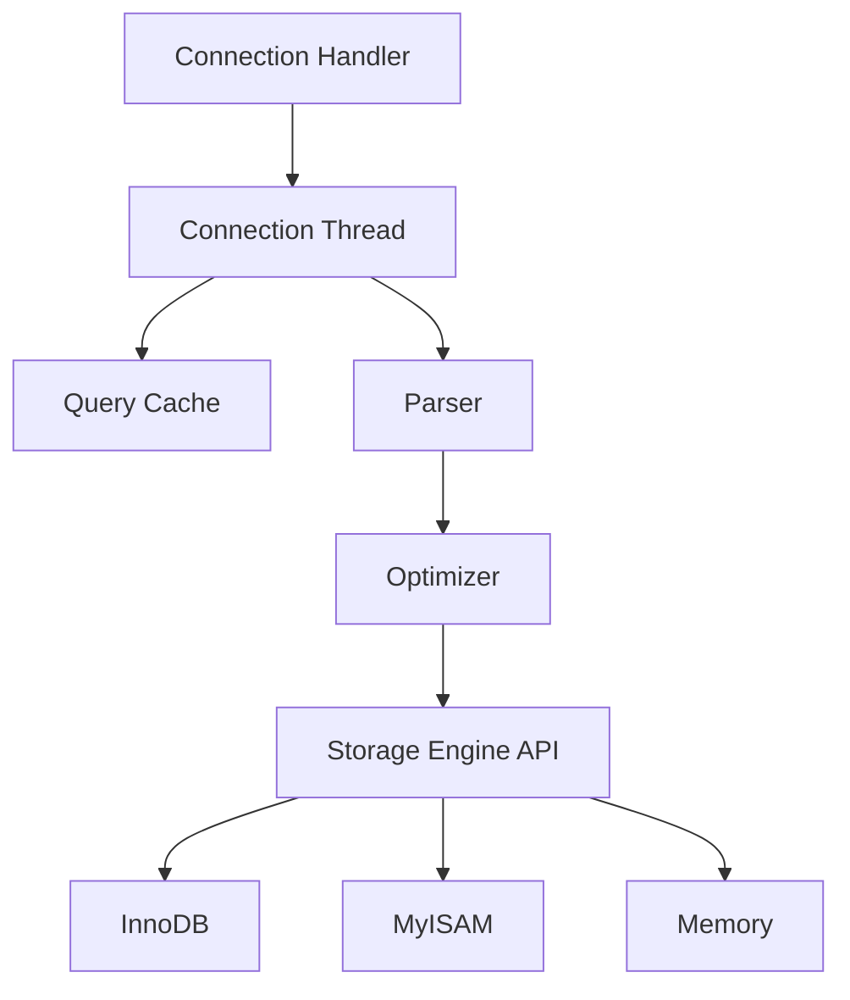
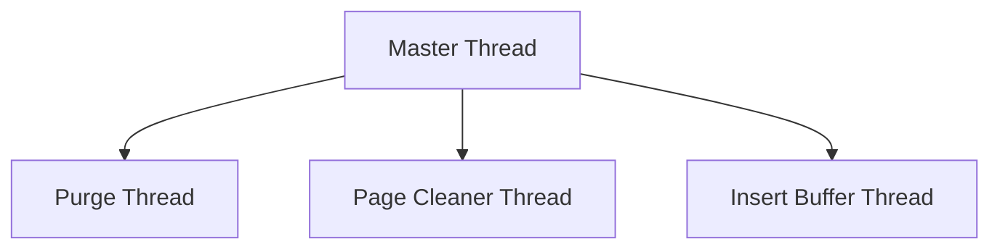
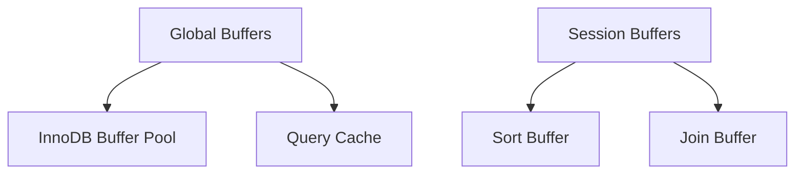
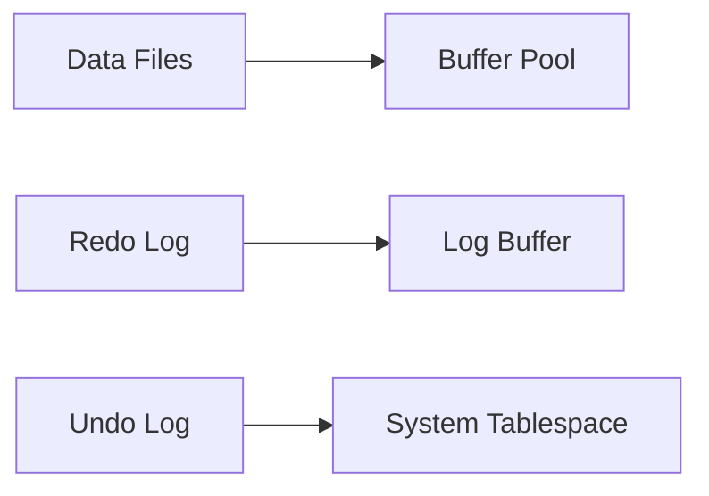

# Архитектура MySQL

## Введение

MySQL - это одна из самых популярных реляционных СУБД, использующая многопоточную архитектуру. Рассмотрим её основные компоненты и особенности.

## Основные компоненты

### 1. Архитектура потоков MySQL



#### Основные потоки
- **Connection Handler**
    - Управляет входящими соединениями
    - Создает потоки для каждого соединения
    - Поддерживает пул потоков

- **Worker Threads**
    - Обрабатывают запросы клиентов
    - Кэшируют результаты
    - Управляют транзакциями

#### Системные потоки


- **Master Thread**
    - Главный поток InnoDB
    - Координирует другие потоки
    - Выполняет фоновые операции

### 2. Организация памяти



#### Глобальные буферы
- **InnoDB Buffer Pool**
    - Кэш данных и индексов
    - Рекомендуемый размер: 70-80% RAM
    
- **Query Cache** (устарел в MySQL 8.0)
    - Кэш результатов запросов
    - Требует точного совпадения запросов

#### Сессионные буферы
- **sort_buffer_size**
    - Для операций сортировки
    - Выделяется для каждого потока
    
- **join_buffer_size**
    - Для операций соединения
    - Используется при отсутствии индексов

### 3. Механизмы хранения (Storage Engines)

#### InnoDB


- Транзакционный механизм
- ACID-совместимый
- Row-level locking
- Поддержка внешних ключей

#### MyISAM
- Нетранзакционный механизм
- Table-level locking
- Быстрое чтение
- Полнотекстовый поиск

### 4. Файловая структура

```bash
/var/lib/mysql/
├── ibdata1         # Системное табличное пространство
├── ib_logfile0     # Файлы redo log
├── ib_logfile1
├── database_name/  # Каталоги баз данных
│   ├── table1.ibd  # Файлы таблиц InnoDB
│   ├── table2.frm  # Файлы определений таблиц
│   └── table3.MYD  # Файлы данных MyISAM
└── mysql/          # Системная база данных
```

## Практические примеры

### Мониторинг состояния InnoDB
```sql
SHOW ENGINE INNODB STATUS\G

SELECT name, count 
FROM information_schema.innodb_metrics 
WHERE subsystem = 'buffer_pool';
```

### Анализ потоков
```sql
SHOW PROCESSLIST;

SELECT thread_id, name, type, processlist_user, processlist_host
FROM performance_schema.threads
WHERE type = 'FOREGROUND';
```

## Рекомендации по настройке

### Память
```ini
# Для сервера с 32GB RAM
innodb_buffer_pool_size = 24G
innodb_buffer_pool_instances = 8

# Для сортировки и соединений
sort_buffer_size = 2M
join_buffer_size = 1M
```

### Потоки и соединения
```ini
# Максимальное количество соединений
max_connections = 1000

# Пул потоков
thread_cache_size = 100
thread_stack = 256K
```

### InnoDB настройки
```ini
# Размер лог-файла
innodb_log_file_size = 2G

# Размер буфера логов
innodb_log_buffer_size = 16M

# Параллельные потоки чтения/записи
innodb_read_io_threads = 8
innodb_write_io_threads = 8
```

## Вопросы для самопроверки

1. В чем основное отличие архитектуры MySQL от PostgreSQL?
   - [x] MySQL использует многопоточность, PostgreSQL - многопроцессность
   - [ ] MySQL не поддерживает транзакции
   - [ ] PostgreSQL не имеет буферного пула

2. Какой механизм хранения следует использовать для обеспечения ACID?
   - [x] InnoDB
   - [ ] MyISAM
   - [ ] MEMORY

3. Что произойдет при переполнении innodb_buffer_pool?
   - [ ] База данных остановится
   - [x] Старые страницы будут вытеснены по алгоритму LRU
   - [ ] Произойдет автоматическое увеличение размера

## Сравнение с PostgreSQL

| Характеристика | MySQL | PostgreSQL |
|----------------|-------|------------|
| Архитектура | Многопоточная | Многопроцессная |
| Основной буфер | InnoDB Buffer Pool | Shared Buffers |
| Изоляция | Потоки в одном процессе | Отдельные процессы |
| Механизмы хранения | Подключаемые (InnoDB, MyISAM) | Встроенный |
| Блокировки | Table/Row-level (зависит от engine) | Row-level |

## Дополнительные материалы

- [MySQL Server Architecture](https://dev.mysql.com/doc/refman/8.0/en/mysqld-server.html)
- [InnoDB Architecture](https://dev.mysql.com/doc/refman/8.0/en/innodb-architecture.html)
- [Performance Schema](https://dev.mysql.com/doc/refman/8.0/en/performance-schema.html)

## Практическое задание

1. Настройте MySQL для сервера с характеристиками:
   - 128GB RAM
   - 32 CPU cores
   - NVMe SSD
   - Нагрузка: OLTP, 2000 транзакций в секунду

2. Обоснуйте выбор параметров:
   - innodb_buffer_pool_size
   - innodb_buffer_pool_instances
   - innodb_log_file_size
   - innodb_read_io_threads
   - innodb_write_io_threads