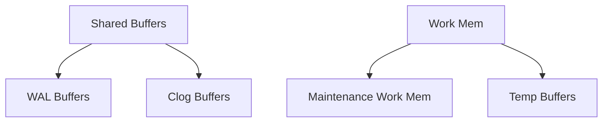

# Архитектура PostgreSQL

## Введение

PostgreSQL - это объектно-реляционная система управления базами данных (СУБД), которая развивается более 30 лет. В этом разделе мы рассмотрим её архитектуру и основные компоненты.

## Основные компоненты

### 1. Процессы PostgreSQL

PostgreSQL использует мультипроцессную архитектуру, где каждый компонент выполняет специфическую роль:

#### Основные процессы
- **postmaster (postgres)** - главный процесс, который:
    - Прослушивает входящие соединения
    - Создает дочерние процессы
    - Выполняет восстановление после сбоев
    
- **backend process** - процесс, обслуживающий одного клиента:
    - Аутентификация
    - Выполнение запросов
    - Управление транзакциями

#### Фоновые процессы
- **background writer**
    - Записывает "грязные" страницы на диск
    - Уменьшает нагрузку при checkpoint

- **checkpointer**
    - Выполняет checkpoint
    - Синхронизирует данные с диском

- **autovacuum launcher**
    - Запускает процессы autovacuum
    - Очищает "мертвые" строки
    - Обновляет статистику

### 2. Память PostgreSQL



#### Разделяемая память
- **shared_buffers**
    - Кэш данных в памяти
    - Рекомендуемый размер: 25% RAM
    
- **wal_buffers**
    - Буфер для WAL записей
    - По умолчанию: 16MB

#### Локальная память
- **work_mem**
    - Для операций сортировки
    - Для хеш-таблиц
    
- **maintenance_work_mem**
    - Для VACUUM, CREATE INDEX
    - Больше значение = быстрее операции

### 3. Файловая структура

```bash
$PGDATA/
├── base/          # Табличные пространства по умолчанию
├── global/        # Общие объекты
├── pg_wal/        # WAL файлы
├── pg_xact/       # Информация о транзакциях
└── postgresql.conf # Конфигурация
```

## Практические примеры

### Проверка активных процессов
```sql
SELECT pid, usename, application_name, state
FROM pg_stat_activity;
```

### Мониторинг использования памяти
```sql
SELECT name, setting, unit, context
FROM pg_settings
WHERE name LIKE '%mem%' OR name LIKE '%buff%';
```

## Рекомендации по настройке

### Память
1. shared_buffers:
   ```ini
   # Для сервера с 32GB RAM
   shared_buffers = 8GB
   ```

2. work_mem:
   ```ini
   # Зависит от concurrent_connections
   work_mem = 32MB
   ```

### Процессы
1. max_connections:
   ```ini
   # Рассчитывается исходя из RAM
   max_connections = 200
   ```

2. autovacuum:
   ```ini
   autovacuum = on
   autovacuum_max_workers = 4
   ```

## Вопросы для самопроверки

1. Какой процесс отвечает за создание новых backend процессов?
   - [ ] backend process
   - [x] postmaster
   - [ ] autovacuum launcher

2. Что произойдет при переполнении shared_buffers?
   - [ ] База данных остановится
   - [x] Старые страницы будут вытеснены
   - [ ] Произойдет crash системы

3. Зачем нужен процесс checkpointer?
   - [x] Для синхронизации данных с диском
   - [ ] Для обработки запросов
   - [ ] Для репликации данных

## Дополнительные материалы

- [Официальная документация по архитектуре](https://www.postgresql.org/docs/current/architecture.html)
- [Wiki по настройке производительности](https://wiki.postgresql.org/wiki/Performance_Optimization)
- [Calculating PostgreSQL Memory Requirements](https://www.postgresql.org/docs/current/runtime-config-resource.html)

## Практическое задание

1. Настройте PostgreSQL для сервера с следующими характеристиками:
   - 64GB RAM
   - 16 CPU cores
   - SSD storage
   - Предполагаемая нагрузка: 1000 concurrent connections

2. Объясните ваш выбор параметров:
   - shared_buffers
   - work_mem
   - maintenance_work_mem
   - effective_cache_size